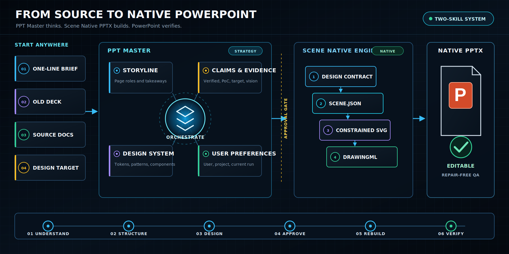

<div align="center">

# PPT Master + Scene Native PPTX

### Stop rebuilding slides by hand. Ship native, editable PowerPoint from almost anything.

**Drop in a brief, an old deck, source documents, screenshots, or a finished design. Get back a presentation that is ready to present, revise, and deliver in Microsoft PowerPoint.**

This is not another AI that stops at attractive layouts. It combines **storyline, evidence, deck design, scoped preferences, native editable production, and real PowerPoint QA** in one reusable skill stack.

<p>
  <a href="https://github.com/denelwu-GH/scene-native-pptx/actions/workflows/ci.yml"></a>
  <a href="https://github.com/denelwu-GH/scene-native-pptx/releases/tag/v0.2.0"></a>
  <a href="LICENSE"></a>
  
  
</p>

<p><strong>English</strong> | <a href="README.zh-CN.md">简体中文</a> · <a href="CHANGELOG.md">Changelog</a></p>

</div>

<p align="center">
  
</p>

<p align="center"><strong>It does not put a picture inside PowerPoint. It turns the design into PowerPoint.</strong></p>

<p align="center">
  
</p>

<p align="center"><sub>Design target → semantic layers → native objects → editable PowerPoint</sub></p>

## You may never want to rebuild a deck by hand again

Plenty of tools can generate something that looks like a presentation. The compromises appear when the file has to survive real delivery:

- keep the design as one flat image and lose editability;
- recover text with OCR and accept missing words or layout drift;
- slice icons and frames into fragile image layers;
- rebuild everything manually and lose the original visual quality.

**PPT Master first turns the material into a presentation that can persuade. Scene Native PPTX then rebuilds the approved design as real PowerPoint content.** In `native-first` mode, text, cards, connectors, icons, gradients, and semantic groups become native DrawingML objects that can be selected, moved, recolored, and rewritten.

## One skill stack for the entire PowerPoint job

From “I have a pile of source material” to “this deck is ready for the room,” each layer owns the work it does best:

| Skill | Responsibility |
| --- | --- |
| **`ppt-master`** | Audience and source audit, storyline, claims, user and project preferences, deck design system, inclusive design, approval gates, and deck-level QA |
| **`scene-native-pptx`** | High-fidelity design reconstruction, constrained SVG, native DrawingML conversion, package validation, and PowerPoint round-trip QA |

<p align="center">
  
</p>

<p align="center"><sub>Start with whatever you have. Approve the thinking and the design. Deliver a PowerPoint that remains editable.</sub></p>

| Start with | Use | Result |
| --- | --- | --- |
| Brief, source documents, or an old deck | `$ppt-master` | Storyline, evidence, deck system, visual direction, and native delivery |
| Screenshot or approved design | `$scene-native-pptx` | High-fidelity native editable reconstruction |

Use the engine alone when a finished design already exists. Use PPT Master when the presentation still needs thinking before it needs drawing.

## What lands in PowerPoint

<table>
  <tr>
    <td width="50%" align="center">
      <br>
      <strong>All-native output</strong><br>
      85 native shapes · 31 editable text runs · 0 pictures
    </td>
    <td width="50%" align="center">
      <br>
      <strong>Hybrid-fidelity output</strong><br>
      53 native shapes · 22 editable text runs · 1 replaceable artwork
    </td>
  </tr>
</table>

These are public synthetic regression pages rendered after a real Microsoft PowerPoint save-and-reopen round trip.

## Why PowerPoint power users install it

| What you need | What the two-skill system delivers |
| --- | --- |
| My source material is messy | PPT Master turns it into a storyline, claim register, and page-by-page production contract |
| I do not want to repeat the same feedback | Explicit preferences can be scoped to the user, project, or current run without storing private deck content |
| A slide that still looks designed | A visual design pass remains the fidelity target |
| Exact wording | Text comes from a design contract, not OCR guesses |
| Real editability | Text, cards, paths, connectors, and groups become native objects |
| Files that open cleanly | ZIP, XML, relationships, IDs, overflow, and PowerPoint round trips are validated |
| A workflow your team can repeat | `scene.json` is the deterministic source for SVG and PPTX |
| Complex artwork without flattening the page | Only isolated illustrations stay as replaceable local images |

## Canva and Gamma can start the draft. We finish the PowerPoint.

Canva, Gamma, and Beautiful.ai are strong tools for visual creation, AI-assisted first drafts, and browser-based presentation workflows. But for teams that must deliver a `.pptx`, keep editing it, fit a company template, and survive stakeholder revisions, **generation is only the first half. Working PowerPoint delivery is the second.**

- PPT Master can begin earlier with source documents, an old deck, audience goals, and approval constraints.
- Start with a design that is already visually approved, including an exported slide image from another creation tool.
- Rebuild the meaningful text, geometry, cards, paths, and connectors as native PowerPoint content.
- Deliver a `.pptx` that a recipient can still revise in Microsoft PowerPoint without redrawing the slide.

**Use PPT Master when the presentation still needs strategy. Use Scene Native PPTX when the design is ready for native delivery.** We are not competing to produce the fastest browser draft. We complete the last mile those workflows often leave unfinished: **native, editable, reusable output validated in PowerPoint.** This is a delivery-workflow position, not an affiliation or an unconditional product ranking.

## From design target to editable object

```text
content -> design contract -> design reference -> scene.json
        -> constrained SVG -> native DrawingML -> PPTX
```

- The **design reference** controls visual intent.
- The **design contract** locks exact text, regions, hierarchy, and editability policy.
- **`scene.json`** produces the constrained SVG and native PowerPoint deterministically.
- The **PowerPoint round trip** is the final compatibility gate.

<p align="center">
  
</p>

This is not pixel slicing. A slide is rebuilt as five intentional layers: **background**, **connectors**, **native geometry**, **icons and artwork**, and **editable text**. The result is a `.pptx` where the things people actually need to change can still be selected, moved, recolored, and rewritten.

## Choose the right mode

| Mode | Best for | Output policy |
| --- | --- | --- |
| `native-first` | Architecture pages, process diagrams, cards, dashboards, infographics | Native DrawingML throughout; picture count must remain zero |
| `hybrid-fidelity` | Slides with photography, AI illustrations, complex blur, or brand artwork | Native text and layout plus isolated replaceable PNG/JPEG/WebP assets |
| `gorden-compat` | Existing bitmap slides with no structured source | Legacy background, frame, icon, and text layering as a fallback |

## Install a PowerPoint production line in 30 seconds

```bash
git clone https://github.com/denelwu-GH/scene-native-pptx.git
cp -R scene-native-pptx/skill/scene-native-pptx ~/.codex/skills/scene-native-pptx
cp -R scene-native-pptx/skill/ppt-master ~/.codex/skills/ppt-master
```

Then call `$scene-native-pptx` for direct reconstruction or `$ppt-master` for full-deck production.

## Hand it your next deck in one prompt

```text
Use $ppt-master to turn this source material into a coherent, polished,
accessible, native editable PowerPoint deck. Audit the sources, build the
storyline and claim register, establish the deck design system, get approval
for the visual direction, then use $scene-native-pptx for native production.
```

Already have the design? Start directly with the native engine:

```text
Use $scene-native-pptx to rebuild this slide screenshot as a high-fidelity,
native, editable PowerPoint. Preserve the exact text and layout. Use
native-first unless isolated complex artwork requires hybrid-fidelity, and
complete the full PowerPoint round-trip QA before delivery.
```

## We did not declare it the best. We ran five approaches.


| Route tested | Weighted score | Main limitation |
| --- | ---: | --- |
| Layered raster + editable text | 6.4 / 10 | Framework remains a bitmap; slicing and matte quality vary |
| Componentized shapes + raster icons | 7.4 / 10 | Curves, gradients, and shadows are visibly simplified |
| HTML/DOM to PPTX | 6.8 / 10 | Complex headings, radial graphics, and rich text drift |
| Constrained SVG proof of concept | 8.8 / 10 | Good conversion, but no formal semantic contract or full regression harness |
| **Scene JSON + constrained SVG + DrawingML** | **9.4 / 10** | Requires disciplined scene authoring and final PowerPoint QA |

The score is an engineering benchmark for the same complex-slide use case, not a universal product ranking. It combines visual fidelity, editability, PowerPoint safety, repeatability, and file efficiency. See the [methodology](benchmarks/methodology.md) and [raw scores](benchmarks/benchmark-scores.json).

## Big promise. Public proof.

- A measured native sample produced **185 native shapes, 10 groups, 63 text runs, and 0 pictures**.
- PowerPoint for Mac 16.107 completed **open, save, close, and reopen with no repair prompt**.
- The public two-slide regression preserves **53 exact contract texts with zero skipped conversion groups**.
- The 24.5 KB native result was **84.0% smaller** than the componentized version and **98.3% smaller** than the layered-image version.
- Every public push runs secret/path scanning and the two-sample regression in [GitHub Actions](https://github.com/denelwu-GH/scene-native-pptx/actions).

## Run the regression yourself

```bash
python3 ~/.codex/skills/scene-native-pptx/scripts/run_regression.py \
  --skill-dir ~/.codex/skills/scene-native-pptx \
  --output-dir /tmp/scene-native-pptx-regression

python3 ~/.codex/skills/ppt-master/scripts/run_regression.py \
  --skill-dir ~/.codex/skills/ppt-master \
  --output-dir /tmp/ppt-master-regression
```

The native-engine suite contains an all-native orchestration page and a hybrid page with separately editable artwork. The PPT Master suite checks preference precedence, feedback scope, claims, contrast, approvals, and delivery readiness.

## Repository layout

```text
skill/ppt-master/          full-deck strategy and production orchestrator
skill/scene-native-pptx/   native editable PowerPoint engine
benchmarks/                measured evidence, methodology, charts, and gallery
tools/                     public fixture, chart, metadata, and audit utilities
CHANGELOG.md               public release history
PUBLICATION_AUDIT.md       release-time privacy and secret review
THIRD_PARTY_NOTICES.md     bundled dependency attribution
```

## Releases and change history

- [PPT Master v0.2.0](https://github.com/denelwu-GH/scene-native-pptx/releases/tag/v0.2.0): full-deck orchestration, scoped preferences, deck design systems, inclusive design, claims, and approval gates.
- [Scene Native PPTX v0.1.0](https://github.com/denelwu-GH/scene-native-pptx/releases/tag/v0.1.0): initial public native-editable reconstruction engine.
- Read the complete [Changelog](CHANGELOG.md).

## Honest limits

- It does not magically recover perfect semantic structure from every arbitrary screenshot.
- Complex blur, noise, masks, photography, and generative illustrations should remain isolated image assets.
- Pixel metrics alone are insufficient; text flow, object structure, and repair behavior still need inspection.
- LibreOffice and browser rendering are secondary checks, not substitutes for Microsoft PowerPoint.

## Security, privacy, and license

The public fixtures are synthetic examples created for this repository and contain no customer decks, logos, local usernames, or absolute source paths. Read [PUBLICATION_AUDIT.md](PUBLICATION_AUDIT.md) before publishing a fork with your own examples.

The repository is released under the [MIT License](LICENSE). The converter subset under `skill/scene-native-pptx/assets/ppt-master` retains its original MIT notice; see [THIRD_PARTY_NOTICES.md](THIRD_PARTY_NOTICES.md).

---

<div align="center">

### Stop hand-building the next deck. Give PPT Master the sources and take back an editable deliverable.

**[Install the skills](#install-a-powerpoint-production-line-in-30-seconds) · [See the benchmark](#we-did-not-declare-it-the-best-we-ran-five-approaches) · [Read the Chinese guide](README.zh-CN.md)**

</div>
